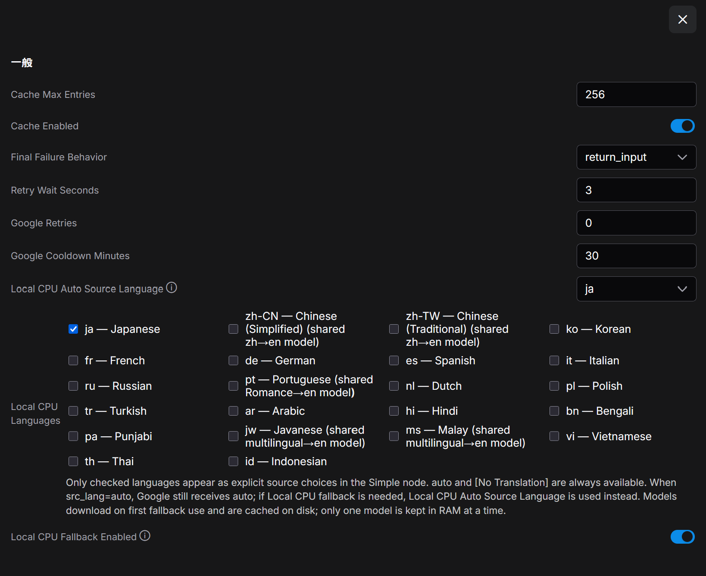

# ComfyUI-FailSafe-Translate-Node

A fail-safe translation node for ComfyUI.

Google Translate remains the primary path. If Google is unavailable or rate-limited, the Simple node can fall back to small **Marian/OPUS translation models running on CPU**. No Ollama, DeepL, MyMemory, LibreTranslate, or API key is required.

## Preview



The Simple node stays compact while fallback languages, `auto` fallback source, Google cooldown, retry behavior, and cache are configured from **Settings → FailSafe Translate**.

**Category**: `utils/text`

## Features

- **Google first** — keeps the original fast Google translation path.
- **Local CPU fallback** — selected source languages can translate to English without external translation services.
- **Lazy model download** — a model is downloaded only when that language actually needs local fallback for the first time.
- **No CUDA VRAM for fallback** — local models are explicitly loaded on CPU.
- **Bounded RAM use** — downloaded models stay cached on disk, but only the most recently used model is kept loaded in RAM.
- **Google 429 cooldown** — a 429 opens a process-wide cooldown (default: 30 minutes) so the node does not keep hammering Google.
- **Process-wide LRU translation cache** — successful translations are cached (default: 256 entries).
- **Compact Simple node** — still only `text` and `src_lang`.
- **Configurable source list** — the Simple node `src_lang` combo always keeps `auto` and `[No Translation]`, plus the languages checked in **Settings → FailSafe Translate → Local CPU Languages**.

## Translation flow

```text
Google
  ├─ success -> translated text
  └─ failure / 429 cooldown
        -> Local CPU model for selected src_lang -> English
             ├─ success -> translated text
             └─ unavailable/failure -> configured final failure behavior
```

`auto` is always available in the Simple node. Google receives `auto` exactly as before. If Google fails and Local CPU fallback is needed, the node uses **Local CPU Auto Source Language** (default: `ja`) as the assumed source language for the local model. The local fallback does not perform language detection itself. `[No Translation]` is always available.

The Advanced node keeps its legacy full source/destination language lists for workflow compatibility. Local CPU fallback is still only used for **enabled source language → English** pairs; other pairs remain Google-only.

## Local CPU language models

Default enabled language: **Japanese (`ja`) only**. Enable any additional languages in ComfyUI Settings.

| src_lang | Language | Local model | Notes |
| --- | --- | --- | --- |
| `ja` | Japanese | `Helsinki-NLP/opus-mt-ja-en` | dedicated |
| `zh-CN` | Chinese (Simplified) | `Helsinki-NLP/opus-mt-zh-en` | shared with `zh-TW` |
| `zh-TW` | Chinese (Traditional) | `Helsinki-NLP/opus-mt-zh-en` | shared with `zh-CN` |
| `ko` | Korean | `Helsinki-NLP/opus-mt-ko-en` | dedicated |
| `fr` | French | `Helsinki-NLP/opus-mt-fr-en` | dedicated |
| `de` | German | `Helsinki-NLP/opus-mt-de-en` | dedicated |
| `es` | Spanish | `Helsinki-NLP/opus-mt-es-en` | dedicated |
| `it` | Italian | `Helsinki-NLP/opus-mt-it-en` | dedicated |
| `ru` | Russian | `Helsinki-NLP/opus-mt-ru-en` | dedicated |
| `pt` | Portuguese | `Helsinki-NLP/opus-mt-ROMANCE-en` | shared Romance → English model |
| `nl` | Dutch | `Helsinki-NLP/opus-mt-nl-en` | dedicated |
| `pl` | Polish | `Helsinki-NLP/opus-mt-pl-en` | dedicated |
| `tr` | Turkish | `Helsinki-NLP/opus-mt-tr-en` | dedicated |
| `ar` | Arabic | `Helsinki-NLP/opus-mt-ar-en` | dedicated |
| `hi` | Hindi | `Helsinki-NLP/opus-mt-hi-en` | dedicated |
| `bn` | Bengali | `Helsinki-NLP/opus-mt-bn-en` | dedicated |
| `pa` | Punjabi | `Helsinki-NLP/opus-mt-pa-en` | dedicated |
| `jw` | Javanese | `Helsinki-NLP/opus-mt-mul-en` | shared multilingual → English model |
| `ms` | Malay | `Helsinki-NLP/opus-mt-mul-en` | shared multilingual → English model |
| `vi` | Vietnamese | `Helsinki-NLP/opus-mt-vi-en` | dedicated |
| `th` | Thai | `Helsinki-NLP/opus-mt-th-en` | dedicated |
| `id` | Indonesian | `Helsinki-NLP/opus-mt-id-en` | dedicated |

The Hugging Face model cards are the authority for each model's license. Most of these models are Apache-2.0; `opus-mt-zh-en` and `opus-mt-ru-en` are CC-BY-4.0 at the time of this update. The node downloads model files at runtime rather than redistributing model weights.

Model downloads are cached under:

```text
ComfyUI/models/failsafe_translate/
```

If ComfyUI's `folder_paths` is unavailable, the fallback location is `~/.cache/failsafe_translate`. You can override the directory with the `FAILSAFE_TRANSLATE_MODEL_DIR` environment variable.

## ComfyUI Settings

Open **Settings → FailSafe Translate**.

| Setting | Default | Notes |
| --- | ---: | --- |
| Local CPU Fallback Enabled | `true` | Use local CPU translation when Google fails/cools down |
| Local CPU Languages | `ja` | Checked languages become explicit Simple-node `src_lang` choices |
| Local CPU Auto Source Language | `ja` | Source language assumed by Local CPU only when the node is set to `auto`; Google still uses automatic detection |
| Google Cooldown Minutes | `30` | Process-wide cooldown after Google 429 |
| Google Retries | `0` | Simple-node retries for transient Google errors |
| Retry Wait Seconds | `3` | Delay between Google retries |
| Final Failure Behavior | `return_input` | `return_input` / `return_error` / `raise` |
| Cache Enabled | `true` | Process-wide LRU cache |
| Cache Max Entries | `256` | Maximum cached translations |

Changing **Local CPU Languages** refreshes ComfyUI node definitions so existing Simple-node combo lists should update immediately. If a frontend version does not refresh them automatically, use **Refresh Node Definitions** (`R`) or reload the browser.

Settings are stored in `failsafe_translate_config.json` in this custom-node directory. The file is excluded from Git.

## Installation

```bash
cd ComfyUI/custom_nodes/
git clone https://github.com/ah-kun/ComfyUI-FailSafe-Translate-Node.git
cd ComfyUI-FailSafe-Translate-Node
pip install -r requirements.txt
```

The local fallback uses `transformers`, `sentencepiece`, and `sacremoses`. PyTorch is not listed because ComfyUI already provides it.

## Usage

### Prompt Translate (Google, Fail-safe)

- `text`: input text
- `src_lang`: `auto`, the languages selected in **Local CPU Languages**, and `[No Translation]`
- output: English

The default list is therefore very short: `auto`, `ja`, and `[No Translation]`. `auto` remains the default for newly created Simple nodes.

### Prompt Translate (Google, Fail-safe, Advanced)

Keeps the existing Advanced widget contract and legacy language lists:

- `text`
- `src_lang`
- `dest_lang`
- `fail_mode`: `return_input`, `return_cached`, `return_error`, `raise`
- `retries`
- `retry_wait_sec`

Advanced retry values apply to Google. Local CPU translation is not retried because local failures are generally deterministic.

---

# 日本語

ComfyUI用のフェイルセーフ翻訳ノードです。通常は**Google翻訳**を使い、Googleが429や通信エラーで利用できない場合だけ、選択した言語用の**小型Marian/OPUSモデルをCPUで実行**します。

## 主な特徴

- Googleをメインに利用
- MyMemory / LibreTranslate / DeepL / Ollama / APIキー不要
- ローカル翻訳はCPU固定で、CUDA VRAMを使わない
- 初回フォールバック時だけ、その言語のモデルをHugging Faceからダウンロード
- モデルファイルはディスクにキャッシュし、RAM上には最後に使った1モデルだけ保持
- Google 429時はプロセス全体でクールダウン
- 翻訳結果はLRUキャッシュ
- Simpleノードは `text` と `src_lang` だけのまま
- `src_lang` の候補は **設定 → FailSafe Translate → Local CPU Languages** で絞り込み可能

## Local CPU Languages

デフォルトで明示的に有効なローカル言語は **`ja`（日本語）のみ**です。Simpleノードの `src_lang` は通常、

```text
auto
ja
[No Translation]
```

になります。`auto` と `[No Translation]` は常に残り、それ以外は必要な言語だけSettingsでチェックしてください。変更時にはNode Definitionsを自動更新します。

`src_lang=auto` の場合、Googleには従来どおり `auto` を渡します。Googleが失敗してローカルフォールバックに入った時だけ、**Local CPU Auto Source Language**（デフォルト `ja`）で指定した言語としてローカル翻訳します。ローカル側では言語自動判定を行いません。ローカルフォールバックは **ソース言語 → 英語** のみです。

現行の旧リストにあった翻訳言語はすべてローカル候補を用意しています。ただし、`pt` は `opus-mt-ROMANCE-en`、`jw` と `ms` は `opus-mt-mul-en` という共有OPUSモデルを使います。Settings画面にもこの点を表示します。

モデルは通常、次へ保存されます。

```text
ComfyUI/models/failsafe_translate/
```

初回だけダウンロード待ちが発生します。Googleが正常な間はローカルモデルをロードしません。
